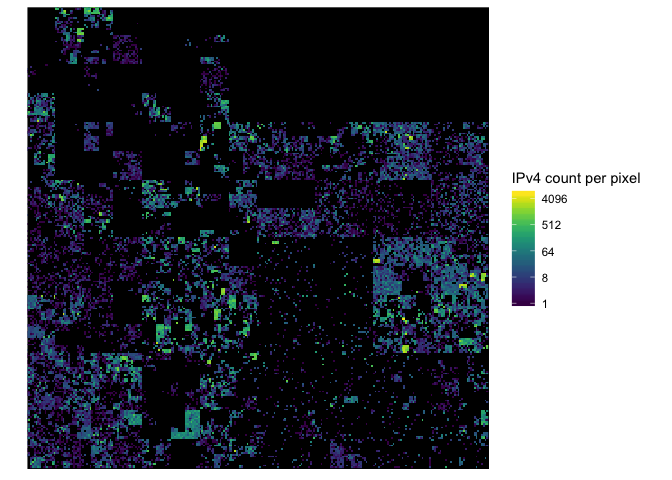

# hilbertv4

Create and Annotate ‘Hilbert Curve’ ‘IPv4’ Heatmaps

## Description

A 12th-order ‘Hilbert Curve’ can be used to represent the entire ‘IPv4’
address space with each pixel being one ‘Class C’ (256 nodes). Tools are
provided to tranform sets of ‘IPv4’ addresses into ‘Hilbert Curve’
position values and, ultimately, ‘ggplot2’ objects.

Locating a particular IP address along the curve can be confusing at
first. Here is what a 2nd-order Hilbert curve looks like:

    0---1   14--15
        |   |
    3---2   13--12
    |            |
    4   7---8   11
    |   |   |    |
    5---6   9---10

## What’s Inside The Tin

The following functions are implemented:

  - `CoordHilbertV4`: ggplot2 ‘Coord’ for Hilbert IPv4 heatmaps
  - `coord_hilbert_v4`: ggplot2 ‘Coord’ for Hilbert IPv4 heatmaps
  - `hilbertv4`: Create and Annotate ‘Hilbert Curve’ ‘IPv4’ Heatmaps
  - `StatHilbertV4`: ggplot2 ‘Stat’ for Hilbert IPv4 heatmaps
  - `stat_hilbert_v4`: ggplot2 ‘Stat’ for Hilbert IPv4 heatmaps
  - `theme_hilbert_v4`: “Map” theme for Hilbert IPv4 maps

## Installation

``` r
devtools::install_github("hrbrmstr/hilbertv4")
```

## Usage

``` r
library(hilbertv4)
library(ggplot2)

# current verison
packageVersion("hilbertv4")
```

    ## [1] '0.1.0'

``` r
ip_df <- readRDS("sample/ips.rds")

ggplot(ip_df, aes(ip=ip)) +
  stat_hilbert_v4(bpp=16) +
  coord_hilbert_v4(bpp=16) +
  viridis::scale_fill_viridis(name="IPv4 count per pixel", trans="log2") +
  theme_hilbert_v4()
```

<!-- -->
